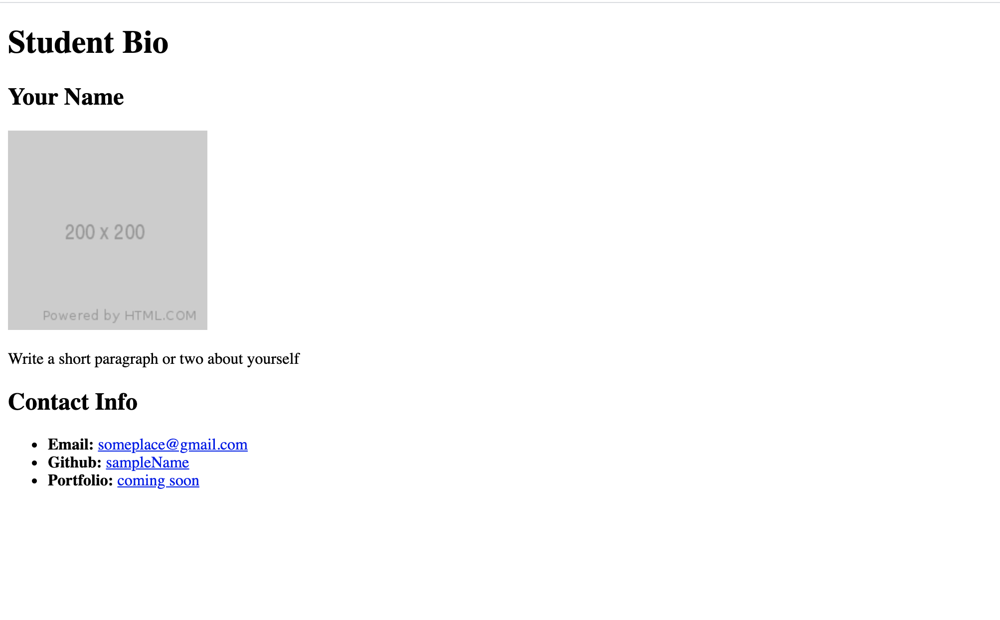

# 🏗️ Create a Webpage Using HTML

Work with a partner to implement the following user story:

* As a student, I want to create a biography page that includes an image, a paragraph about me, and my contact information.

## Acceptance Criteria

* It's done when the main header reads "Student Bio".

* It's done when there is a section that includes a name, an image, and a paragraph.

* It's done when there is a second section that includes a subheader labeled "Contact Info" and a list that includes links to my email, GitHub, and portfolio.

* It's done when the finished page matches the mockup.

## Assets

The following image demonstrates the web application's appearance and functionality:

You can use this [placeholder image](https://via.placeholder.com/200).

---

## 💡 Hints

How can you use header elements to define the most important heading and the subheaders? How does using different header elements impact the size of the text?

## 🏆 Bonus

If you have completed this activity, work through the following challenge with your partner to further your knowledge:

* What are the advantages of using semantic HTML elements?

Use [Google](https://www.google.com) or another search engine to research this.

---
© 2022 Trilogy Education Services, LLC, a 2U, Inc. brand. Confidential and Proprietary. All Rights Reserved.
