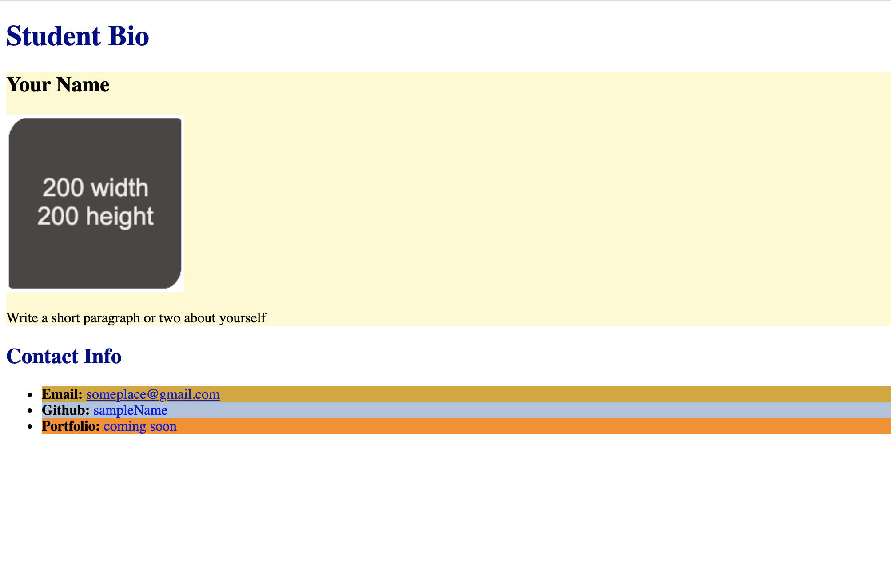

# 🐛 Images and Styles Not Appearing on Page

Work with a partner to resolve the following issues:

* As a user, I should be able to see an image on the page, and `alt` text that describes the image should be provided.

* As a user, I should see background colors applied to each section and list item, and the header text should be dark blue.

## Expected Behavior

* When a user opens the page, an image should appear, and `alt` text describing the image should be provided.

* When a user opens the page, each section and list item should have a background color applied, and the header text should be dark blue.

## Actual Behavior

* When a user opens the page, no image appears and `alt` text describing the image is not shown.

* When a user opens the page, each section and list item does not have a background color applied.

* When a user opens the page, the header text is not dark blue.

## Assets

The following image demonstrates the web application's appearance and functionality:

---

## 💡 Hints

Why is it important to give each global attribute a unique name?

## 🏆 Bonus

If you have completed this activity, work through the following challenge with your partner to further your knowledge:

* What other attributes can be used with HTML elements?

Use [Google](https://www.google.com) or another search engine to research this.

---
© 2022 Trilogy Education Services, LLC, a 2U, Inc. brand. Confidential and Proprietary. All Rights Reserved.
