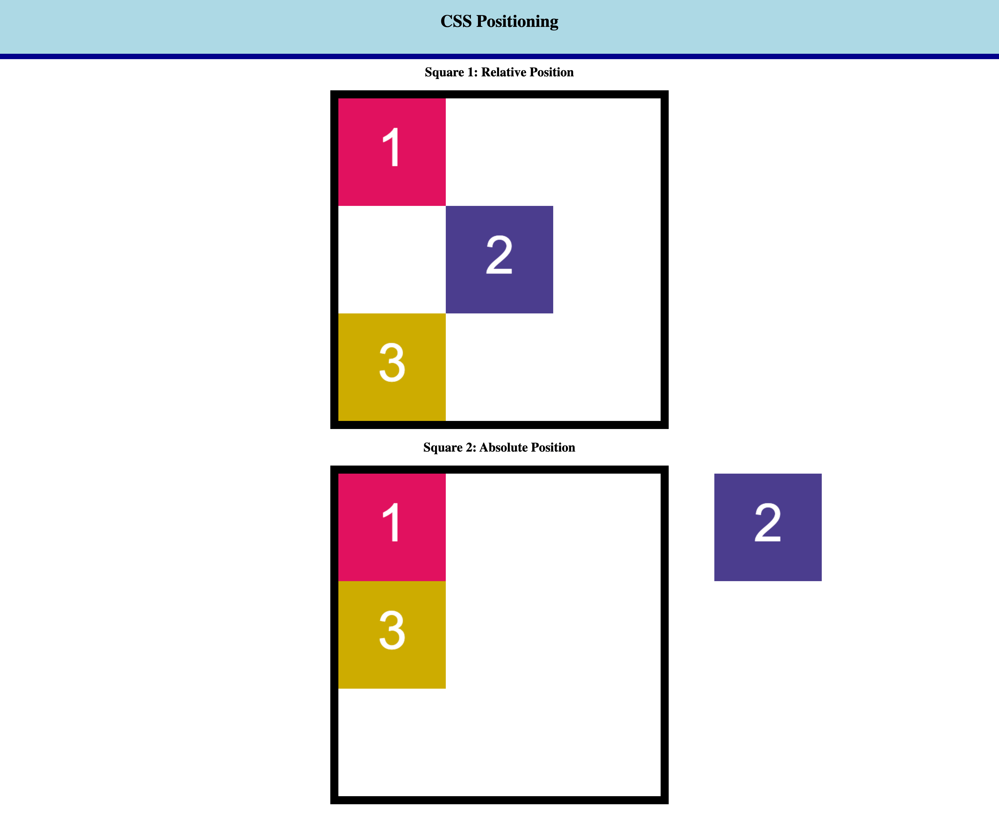

# 🏗️ Implement Absolute and Relative Positioning to Change Layout

Work with a partner to implement the following user story:

* As a developer, I want to use the CSS `position` property to change the layout of my page.

## Acceptance Criteria

* It's done when `box 2` is positioned in the middle of `square 1` using relative positioning.

* It's done when `box 2` is positioned outside of the upper-right corner of `square 2` using absolute positioning.

* It's done when the finished page matches the mockup.  

## Assets

The following image demonstrates the web application's appearance and functionality:

---

## 💡 Hints

How does the CSS `position` property change the document's normal flow? 

## 🏆 Bonus

If you have completed this activity, work through the following challenge with your partner to further your knowledge:

* What is the `z-index` property? 

Use [Google](https://www.google.com) or another search engine to research this.

---
© 2022 Trilogy Education Services, LLC, a 2U, Inc. brand. Confidential and Proprietary. All Rights Reserved.
