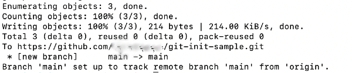
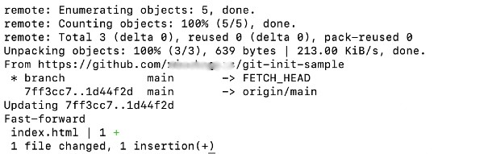

# Set Up a Local Repository with Git

In this activity, we will explore configuring the local Git default branch to `main`. We will also review another way to create a repository, using the `git init` command. Lastly, we will review the `git pull` command.

Git is an important tool that allows developers to track and store versions of content. It also enables you to collaborate and share code with others. During this boot camp, you'll use Git to share code via a class repository, which you'll be required to pull down before each class. In addition, for each homework assignment, you'll provide the grading team with a link to the GitHub repository that contains your code. 

For more information, review the [Full-Stack Blog guide on getting started with Git](https://coding-boot-camp.github.io/full-stack/git/getting-started-with-git).

## Configure Local Git Default Branch to main

First we need to set the local Git default branch to `main`.

Historically, the most common name for the main body of a codebase has been `master`. However, `main` has been gaining in popularity. In fact, GitHub now uses `main` as the default name for its repositories&mdash;as do the projects in this course. 

While GitHub has changed their default branch conventions, your local machine will still initialize projects using the `master` branch. Therefore, you'll need to manually change it to `main`.

> **Important:** If you've already configured your local default branch to `main`, you don't need to repeat this step.

To check the version of Git that you have installed on your local machine, enter the following command in the command line:

  ```bash
  git --version
  ```

If your version of Git is 2.28 or older, you'll first need to update Git.

* Windows users can visit the [Downloading Git website](https://git-scm.com/download/win) and download the latest "64-bit Git for Windows Setup" file.

* Mac users can use Homebrew to update their version of Git:

  ```bash
  brew upgrade git
  ```

To set the default branch to `main`, both Windows and Mac users will run the following command:

  ```bash
  git config --global init.defaultBranch main
  ```

You will not get a confirmation message. If the configuration is successful, it will simply return to the command-line prompt.

## Initialize a Local Repository

We already learned how to create a remote repository on GitHub and clone it onto the local machine. This time, let's initialize a new repository locally using the `git init` command.

Using `git init` also allows us to turn any existing project into a Git repository easily.

Start by creating a new project directory named `git-init-sample` on your local machine. Ideally, you should have a parent directory to store all of your projects for this course:

  ```bash
  mkdir git-init-sample
  ```

Next, use `cd` to navigate into the new directory and add an `index.html` file using the `touch` command:

  ```bash
  cd git-init-sample
  touch index.html
  ```

To initialize this folder as a Git repository, use `git init`. We need to be in the project folder when we run this command!

  ```bash
  git init
  ```

This creates a new subdirectory named `.git` that contains all of your necessary repository files&mdash;a Git repository skeleton. At this point, nothing in your project is tracked yet. To start version-controlling the existing files in your project, you need to start tracking those files and do an initial commit.

First let's run `git status` to check the status of the files:

  ```bash
  git status
  ```

We should see that `index.html` is currently untracked. Let's add that file to be tracked:

  ```bash
  git add .
  ```

Now if we run `git status` again, we should see that the file is being tracked and is ready to be committed:

  ```bash
  git commit -m "initial commit"
  ```

Now we are ready to connect the local repository to a remote repository on GitHub!

To create a remote repository to store the code, navigate to [GitHub](https://github.com/) and create a new repository by clicking on the green New button at the top left and entering the project name, `git-init-sample`, in the "Repository Name" box. 

> **Important**: Because we are importing an existing repository, make that sure none of the options are checked!

Click the "Create Repository" button. Then copy the code under the header "…or push an existing repository from the command line". It should look like the following example:

  ```bash
  git remote add origin <the HTTPS or SSH URL ending in .git>
  git branch -M main
  git push -u origin main
  ```

> **Note**: If you successfully set your local default branch to `main`, you do not have to run the `git branch -M main` command.

Paste the commands into the command line and press Enter.

If successful, you should see a message that looks like the following image:



## Pull Changes from the Remote Repository

Before each class, it is important that we do a `git pull` to pull down any changes and activity files from the student repository to the local machine. Let's review how to do just that.

To perform a `git pull`, first navigate to the corresponding project directory, which in this case will be `git-init-sample`:

  ```bash
  cd git-init-sample
  ```

Next, use `git pull` to pull down any changes from the remote `git-init-sample` repository. Just like when we did a `git push`, we use `origin` to represent the original directory&mdash;or more precisely the original repository's URL&mdash;followed by the name of the branch, which is `main`:

  ```bash
  git pull origin main
  ```

Right now, the local repository is up to date with the remote repository, so you'll get a message that says "Already up to date". This means that the local version of your repository is up to date with the remote version being hosted on GitHub.

If the remote repository has changes that you don't have locally, you will get a message that lists the changes made, similar to the one shown in the following image:



Both messages indicate that the `git pull` command has been successfully performed.

You can review the changed files by opening them in VS Code.

## Share Remote Repository URL 

For each unit's Homework, you'll be required to share the URL of your repository. 

To share the URL, navigate to your repository on GitHub. Then copy the URL from the address bar and share it with your partner in Slack. To view your partner's repository, simply click on the shared link. 

## Notes

Ask an instructor or TA if you get stuck or have any questions!

For more information, refer to the [Atlassian guide on setting up a repository](https://www.atlassian.com/git/tutorials/setting-up-a-repository).

For more information, read the [Atlassian guide on git pull](https://www.atlassian.com/git/tutorials/setting-up-a-repository/git-config).

---
© 2022 Trilogy Education Services, LLC, a 2U, Inc. brand. Confidential and Proprietary. All Rights Reserved.
